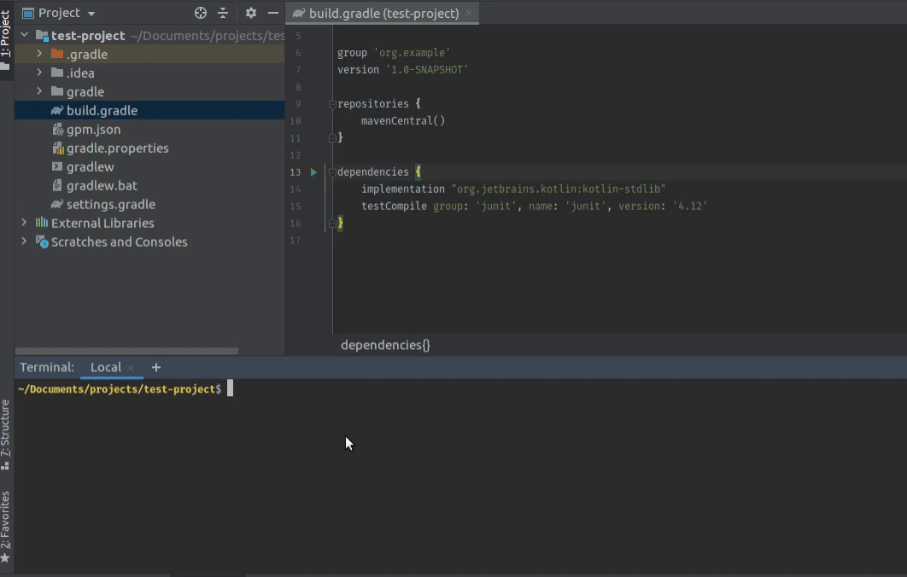

[](https://www.npmjs.com/package/gpm-cli)

<p align="center">
  
</p>

# gpm 📦


GPM is a package manager for Gradle projects. It is inspired by the famous npm package manager. GPM is not a replacement
for the Gradle build system, but a helper to install the dependencies seamlessly to reduce latency. It consists of a
command-line client, also called **gpm**, and an online database of a package directory called the GPM registry. It uses
similar syntax as npm.

## Install ⚙️

```shell script
sudo npm install -g gpm-cli
```

## Usage ⌨️

```shell script
Usage: gpm [-hV] [COMMAND]
  -h, --help      Show this help message and exit.
  -V, --version   Print version information and exit.
Commands:
  install, i    To install the dependency
  uninstall, u  To uninstall a dependency
  docs, d       To open library docs
```

**Example**

To install a library

```shell script
$ gpm i <library-name-or-keyword>
```

*example*

```shell script
$ gpm i okhttp
```



Other supported commands given below

## Features ⚡

| Command                      | Description                                                  | Implemented | Status  | Milestone      |
|------------------------------|--------------------------------------------------------------|-------------|---------|----------------|
| `install`                    | To install the dependency as `implementation`                | ✔️           | Done    | v1.0.0-alpha01 |
| `install --save-dev`         | To install the dependency as `testImplementation`            | ✔️           | Done    | v1.0.0-alpha01 |
| `install --save-dev-android` | To install the dependency as `androidTestImplementation`     | ✔️           | Done    | v1.0.0-alpha01 |
| `uninstall`                  | To uninstall the dependency from `implementation`            | ✔️           | Done    | v1.0.0-alpha01 |
| `uninstall dev`              | To uninstall the dependency from `testImplementation`        | ✔️           | Done    | v1.0.0-alpha01 |
| `uninstall dev-android`      | To uninstall the dependency from `androidTestImplementation` | ✔️           | Done    | v1.0.0-alpha01 |
| `docs`                       | To open the documentation in default browser                 | ✔️           | Done    | v1.0.0-alpha01 |
| `update`                     | To update the dependency version to latest                   | ❌           | Pending | -              |
| `list`                       | To list all the dependencies                                 | ❌           | Pending | -              |

### How can I add my repo to the registry? 🤗

[Create an issue](https://github.com/theapache64/gpm/issues/new) with below given JSON model as the comment body.

```
{
  "name": "YOUR REPO NAME", // Required : Depenedency Name
  "github": "GITHUB REPO", // Optional: In format, user/repo 
  "docs": "DOCUMENTATION-URL", // Optional : Can be full URL or file name. For eg. "README.md",
  "group_id": "LIBRARY GROUP ID", // Required : Eg. "com.squareup.okhttp3"
  "artifact_id": "ARTIFACT ID", // Required: Eg. okhttp
  "get_from" : "WHERES YOUR REPO HOSTED", // Required : Possible value are jcenter, mavenCentral, jitpack
  "default_type": "implementation" // Required: Possible values are implementation, testImplementation, androidTestImplementation
}
```

**Example**

```json
{
  "name": "OkHttp",
  "github": "square/okhttp",
  "docs": "https://square.github.io/okhttp/",
  "groupId": "com.squareup.okhttp3",
  "artifactId": "okhttp",
  "get_from": "jcenter",
  "default_type": "implementation"
}
```

## Project Status 👷

This project is under active development. Tap the `👁️ Watch` button to get updates.

## Author ✍️

- theapache64

